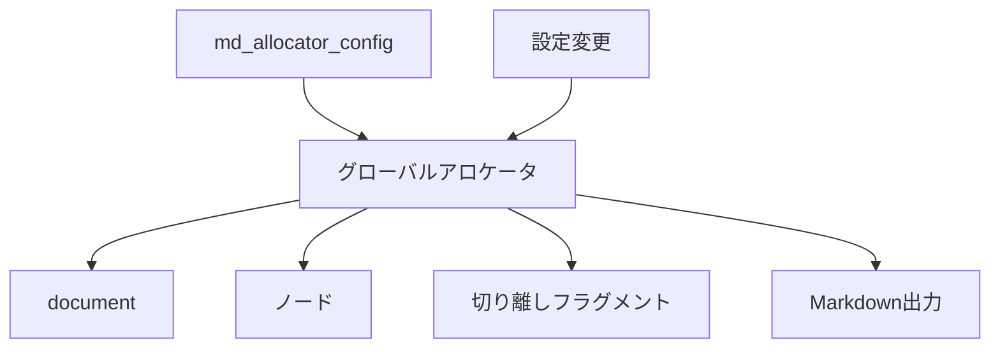

# md-allocator(3)

## NAME

`md_allocator_config` - グローバルアロケータを設定する

## SYNOPSIS

```c
md_status_t md_allocator_config(const md_allocator_t *allocator, md_diag_t *diag);
```

## DESCRIPTION

`md_allocator_config()` は現在の既定アロケータを設定する。`allocator` が NULL の場合は既定の `malloc()`、`realloc()`、`free()` に戻す。非 NULL の `allocator` では3つのコールバックをすべて指定しなければならず、値はライブラリ内部へコピーして保持する。

`malloc` または `realloc` の失敗は NULL で表し、`realloc` の失敗時は元のポインタを変更しない。`free(NULL)` は何もしない。サイズ0の扱いと必要なアラインメントは、使用するコールバックが標準 C の対応する契約を満たすものとする。

## RETURN VALUES

設定に成功した場合は `MD_OK` を返す。非 NULL の `allocator` 内に NULL のコールバックがある場合は `MD_INVALID_ARGUMENT` を返し、現在の設定を変更しない。

## OWNERSHIP

document root を生成する `md_node_create(MD_NODE_DOCUMENT, ...)` と `md_parse()` は、操作時点のグローバルアロケータを参照する。設定変更は既存の document、関連する全ノード、切り離しフラグメントおよびその document から生成した Markdown 出力にも適用される。利用者は設定変更と document 操作を同期し、設定変更前に確保されたメモリを新しいコールバックで正しく扱えることを保証する。



## SEE ALSO

[md-types(3)](md-types.md)、[md-parse(3)](md-parse.md)、[md-node-lifecycle(3)](md-node-lifecycle.md)、[md-serialize(3)](md-serialize.md)
