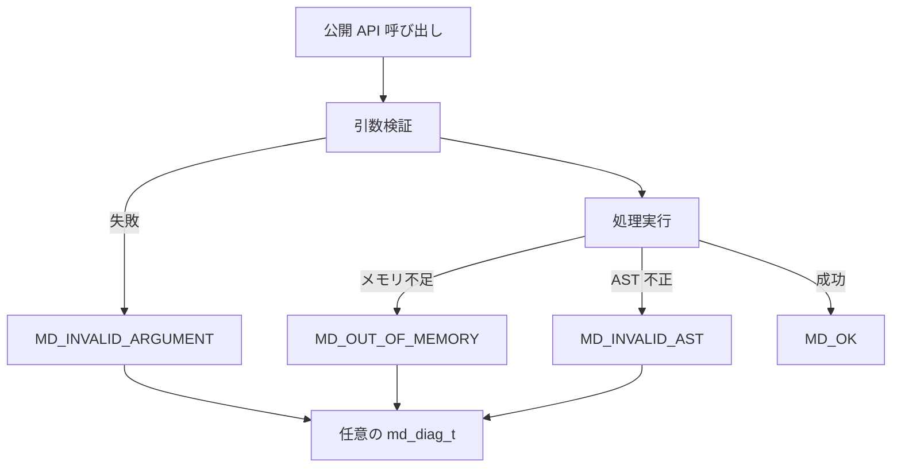

# md-types(3)

## NAME

`md-types` - libmarkdown の公開型、列挙値、定数および診断

## SYNOPSIS

```c
#include <stddef.h>

typedef struct md_node md_node_t;

typedef enum md_status
{
    MD_OK,
    MD_INVALID_ARGUMENT,
    MD_OUT_OF_MEMORY,
    MD_INVALID_AST,
    MD_UNSUPPORTED_NODE,
    MD_INTERNAL_ERROR
} md_status_t;

typedef enum md_node_type
{
    MD_NODE_NONE,
    MD_NODE_DOCUMENT,
    MD_NODE_BLOCK_QUOTE,
    MD_NODE_LIST,
    MD_NODE_LIST_ITEM,
    MD_NODE_CODE_BLOCK,
    MD_NODE_HTML_BLOCK,
    MD_NODE_PARAGRAPH,
    MD_NODE_HEADING,
    MD_NODE_THEMATIC_BREAK,
    MD_NODE_REFERENCE_DEFINITION,
    MD_NODE_TEXT,
    MD_NODE_SOFT_BREAK,
    MD_NODE_HARD_BREAK,
    MD_NODE_CODE,
    MD_NODE_HTML_INLINE,
    MD_NODE_EMPHASIS,
    MD_NODE_STRONG,
    MD_NODE_LINK,
    MD_NODE_IMAGE
} md_node_type_t;

typedef enum md_list_kind
{
    MD_LIST_BULLET,
    MD_LIST_ORDERED
} md_list_kind_t;

typedef enum md_list_delimiter
{
    MD_LIST_DELIMITER_NONE,
    MD_LIST_DELIMITER_PERIOD,
    MD_LIST_DELIMITER_PAREN
} md_list_delimiter_t;

typedef enum md_phase
{
    MD_PHASE_NONE,
    MD_PHASE_ARGUMENT,
    MD_PHASE_ALLOCATION,
    MD_PHASE_PARSE_BLOCK,
    MD_PHASE_PARSE_INLINE,
    MD_PHASE_AST_EDIT,
    MD_PHASE_AST_VALIDATE,
    MD_PHASE_SERIALIZE
} md_phase_t;

typedef enum md_diag_detail
{
    MD_DETAIL_NONE,
    MD_DETAIL_PARENT_ALREADY_SET,
    MD_DETAIL_INVALID_CHILD_TYPE,
    MD_DETAIL_REQUIRED_ATTRIBUTE_MISSING,
    MD_DETAIL_ATTRIBUTE_OUT_OF_RANGE,
    MD_DETAIL_CYCLE_DETECTED,
    MD_DETAIL_SHARED_NODE
} md_diag_detail_t;

typedef struct md_diag
{
    md_status_t status;
    md_phase_t phase;
    size_t input_offset;
    md_node_type_t node_type;
    md_diag_detail_t detail;
} md_diag_t;

typedef struct md_allocator
{
    void *(*malloc)(size_t size);
    void (*free)(void *ptr);
    void *(*realloc)(void *ptr, size_t size);
} md_allocator_t;

#define MD_OFFSET_NONE ((size_t)-1)
```

## DESCRIPTION

`md_node_t` は不透明な AST ノード型である。利用者は内部フィールドへ直接アクセスせず、公開 API を通じてノードを操作する。

`md_node_type_t` は document、ブロックおよびインラインの固定ノード種別を表す。未知のノード種別は生成、編集およびシリアライズで拒否する。

`md_list_kind_t` と `md_list_delimiter_t` は list ノードの種別と区切り文字を表す。`md_allocator_t` は malloc、free および realloc 相当のコールバックを持つ。3つのコールバックはすべて非 NULL でなければならない。

## STATUS

| 値 | 意味 |
| --- | --- |
| `MD_OK` | 操作が成功した。 |
| `MD_INVALID_ARGUMENT` | 必須ポインタ、長さ、列挙値または呼び出し順序が API 契約を満たさない。 |
| `MD_OUT_OF_MEMORY` | 必要なメモリを確保できない。 |
| `MD_INVALID_AST` | AST の構造、不変条件または必須属性が要件を満たさない。 |
| `MD_UNSUPPORTED_NODE` | 対応しないノード種別を生成、編集またはシリアライズしようとした。 |
| `MD_INTERNAL_ERROR` | 前記以外の回復不能なライブラリ内部エラーが発生した。 |

## DIAGNOSTICS

失敗可能な公開操作は `md_status_t` を返す。`diag` 引数に非 NULL の `md_diag_t` を渡した場合、ライブラリは各呼び出しの結果で内容を上書きする。診断オブジェクトは動的メモリを所有せず、呼び出し側が所有する。ライブラリは操作後に診断オブジェクトへの参照を保持しない。

`phase` は argument、allocation、parse_block、parse_inline、ast_edit、ast_validate または serialize を表す。位置情報を持たない失敗の `input_offset` は `MD_OFFSET_NONE`、ノードに関係しない失敗の `node_type` は `MD_NODE_NONE` とする。`detail` は parent_already_set、invalid_child_type、required_attribute_missing、attribute_out_of_range、cycle_detected、shared_node または none を表す。診断の各値は対象操作が返した `md_status_t` と矛盾してはならない。`MD_OK` では `phase` と `detail` を none とする。

公開 API の失敗処理の流れを次に示す。



## SEE ALSO

[md-allocator(3)](md-allocator.md)、[md-parse(3)](md-parse.md)、[md-node-lifecycle(3)](md-node-lifecycle.md)、[md-serialize(3)](md-serialize.md)
