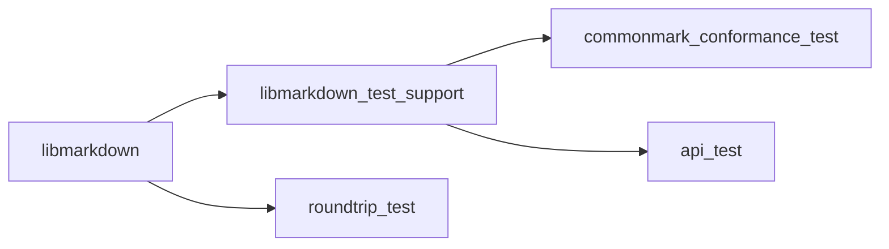
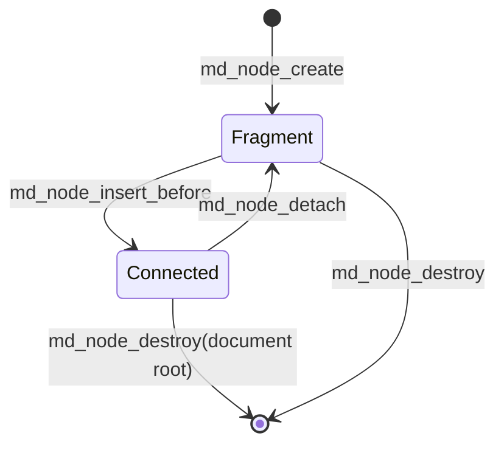
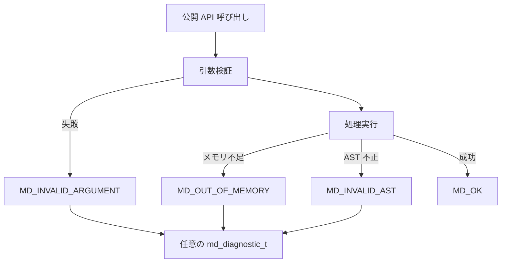
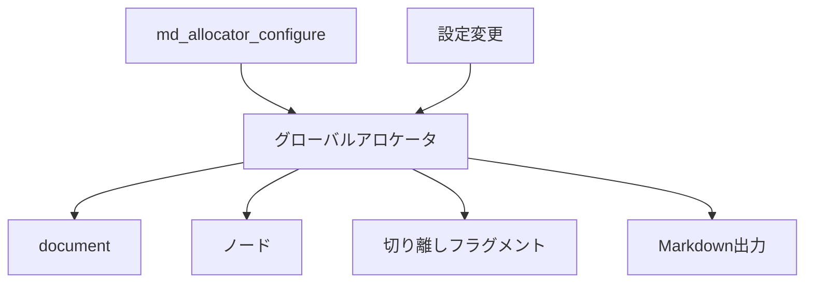
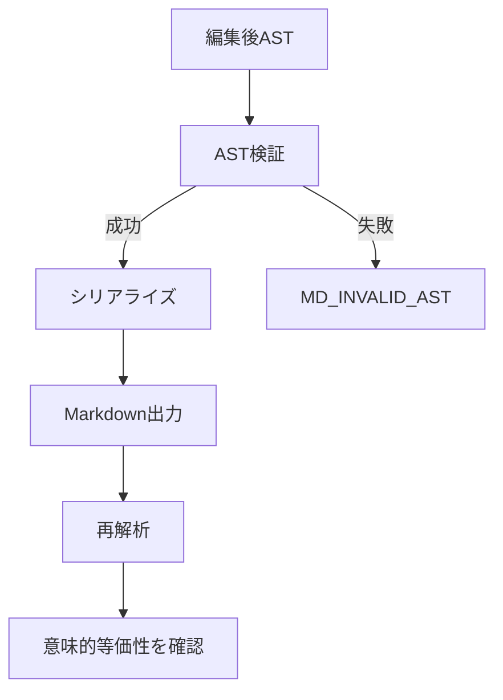

# libmarkdown 設計書

## 1. 目的と適用範囲

本書は、libmarkdown の実装に必要な設計を定義する。libmarkdown は、UTF-8 の Markdown 文字列と編集可能な AST を相互変換する C99 ライブラリである。

公開 API の型、関数および列挙型は `md_` 接頭辞を使用し、公開する列挙値、マクロおよび関連する定数は `MD_` 接頭辞を使用する。この規則は将来追加する公開識別子にも適用する。

Markdown の準拠対象は CommonMark Spec 0.31.2 とする。

ライブラリは Markdown の解析、公開 AST の生成・編集・走査・破棄、および AST の Markdown へのシリアライズを提供する。HTML の生成は公開 API および出荷ライブラリの対象外とし、CommonMark 適合性テスト専用の非公開コードに限定する。

ファイル入出力、コマンドラインインターフェース、独自 Markdown 拡張、および入力記法の字句的な再現は対象外とする。

## 2. アーキテクチャ

ライブラリは次の論理コンポーネントで構成する。

1. 入力検証: API 引数を検証する。文字列の UTF-8 妥当性は呼び出し側の前提条件とし、検証しない。
2. ブロック解析: CommonMark のブロック構造を認識する。
3. インライン解析: ブロック内のインライン構造を認識する。
4. AST 構築・編集: ノード、属性、親子関係および所有権を管理する。
5. AST 検証: ノード種別、必須属性、親子関係および木構造の不変条件を検査する。UTF-8 の妥当性は検査しない。
6. Markdown シリアライズ: 有効な AST から意味的に等価な UTF-8 Markdown を構築する。

解析は入力検証、ブロック解析、インライン解析、AST 構築の順に処理する。シリアライズは AST 検証が成功した場合にだけ出力バッファを構築する。いずれの処理も失敗時に成功結果を返さない。

処理の流れを次に示す。


### 2.1 ビルドおよびテスト構成

プロジェクトは CMake で構成し、C99 を使用する。

出荷ライブラリにはテスト専用コードを含めない。

テスト構成は CTest を有効化し、次のターゲットを分離する。

| ターゲット | 内容 | 依存先 |
| --- | --- | --- |
| `libmarkdown` | 出荷ライブラリ | なし |
| `libmarkdown_test_support` | テスト専用 HTML アダプタ、無効 AST フック、生成済み CommonMark フィクスチャ | `libmarkdown` と内部ヘッダ |
| `commonmark_conformance_test` | 公式 example の HTML 比較 | `libmarkdown_test_support` |
| `roundtrip_test` | AST 正規形によるラウンドトリップ比較 | `libmarkdown` |
| `api_test` | AST 編集、所有権、アロケータ、エラー診断 | `libmarkdown_test_support` |

テストターゲットの依存関係を次に示す。



`libmarkdown_test_support` とテスト実行ファイルには `LIBMARKDOWN_TESTING` を定義する。CMake は各テスト実行ファイルを `add_test()` で登録する。ローカルおよび CI の検証手順は、同じ configure、build、`ctest --output-on-failure` の順とする。

## 3. AST の基本契約

AST のルートは `document` ノードとする。各ノードは高々一つの親を持ち、親子関係は循環およびノード共有を含まない。親が所有する子は、親の破棄時に親とともに破棄する。

親子関係の追加は、子が親を持たず、追加後の親子関係がノード種別ごとの許可規則を満たす場合だけ成功する。切り離しに成功した子の所有権は利用者に移る。失敗する編集操作は、ノード、親子関係および所有権を変更してはならない。

すべてのテキスト属性と属性値は有効な UTF-8 であることを呼び出し側が保証する。ライブラリは UTF-8 の妥当性を検証、正規化または補正しない。この前提に違反する入力を渡した場合の解析結果、シリアライズ結果、診断および文字化けは保証しない。対応しないノード種別、不正な属性、不正な親子関係、循環または共有を含む AST は無効とする。

公開ヘッダは `md_node_t` および `md_markdown_t` を不完全型として宣言する。document も `MD_NODE_DOCUMENT` を持つ `md_node_t` で表す。

利用者はアクセサ API でノード種別、親、子、兄弟、テキストおよびノード固有属性を取得する。利用者はノード内部の可変フィールドへ直接アクセスせず、生成、属性変更、子の追加、切り離しおよび破棄の各 API を通じて編集する。

### 3.1 ノード種別と意味属性

公開 API は次の固定ノード種別を定義する。ノード種別は列挙値で表し、未知の値は生成、編集およびシリアライズで拒否する。

| 区分 | ノード種別 | 意味属性 |
| --- | --- | --- |
| ルート | `document` | なし |
| ブロック | `block_quote` | なし |
| ブロック | `list` | 種別、開始番号、区切り文字、tight/loose |
| ブロック | `list_item` | なし |
| ブロック | `code_block` | コード内容、info string |
| ブロック | `html_block` | HTML 内容 |
| ブロック | `paragraph` | なし |
| ブロック | `heading` | レベル |
| ブロック | `thematic_break` | なし |
| ブロック | `reference_definition` | ラベル、リンク先、タイトル |
| インライン | `text` | テキスト内容 |
| インライン | `soft_break` | なし |
| インライン | `hard_break` | なし |
| インライン | `code` | コード内容 |
| インライン | `html_inline` | HTML 内容 |
| インライン | `emphasis` | なし |
| インライン | `strong` | なし |
| インライン | `link` | リンク先、タイトル |
| インライン | `image` | リンク先、タイトル |

`list` の種別は bullet または ordered とする。bullet リストの開始番号および区切り文字は持たず、ordered リストの開始番号は 1 以上とする。

`heading` のレベルは 1 から 6 とする。タイトルを持たない `link`、`image` および `reference_definition` は、タイトルを未設定として表現する。

`list` の tight/loose は明示的な意味属性とする。パーサーは CommonMark の規則に従って値を設定し、利用者は `md_list_set_tight()` で値を変更できる。

複数のブロック子を持つ `list_item` を含む list を tight に設定する操作は `MD_INVALID_AST` で失敗する。子の追加が loose を必然とする場合、ライブラリは同じ操作で list を loose に更新する。子の削除では自動的に tight へ戻さない。

### 3.2 親子関係マトリクス

次表の子だけを追加できる。ブロック集合は `block_quote`、`list`、`list_item`、`code_block`、`html_block`、`paragraph`、`heading`、`thematic_break` および `reference_definition` とする。

インライン集合は `text`、`soft_break`、`hard_break`、`code`、`html_inline`、`emphasis`、`strong`、`link` および `image` とする。

| 親ノード | 許可する直接の子 | document 接続時の最小子数 |
| --- | --- | --- |
| `document` | `list_item` 以外のブロック集合 | 0 |
| `block_quote` | `list_item` 以外のブロック集合 | 1 |
| `list` | `list_item` | 1 |
| `list_item` | `list_item` 以外のブロック集合 | 1 |
| `paragraph`、`heading`、`emphasis`、`strong` | インライン集合 | paragraph/emphasis/strong は 1、heading は 0 |
| `link` | `link` 以外のインライン集合 | 0 |
| `image` | インライン集合 | 0 |
| `code_block`、`html_block`、`thematic_break`、`reference_definition`、`text`、`soft_break`、`hard_break`、`code`、`html_inline` | なし | 0 |

`document`、`block_quote` および `list_item` の子に `reference_definition` を置ける。

`reference_definition` は属性だけを持つ葉ノードである。`link` の子孫に `link` を置くことはできない。

### 3.3 構築、編集および構造的不変条件

`md_node_create(MD_NODE_DOCUMENT, ...)` が生成する空の document root は有効な AST とする。document root は `md_node_t` の一種だが、親を持たず、子として追加できず、切り離せない。document root と接続済み木は `md_node_destroy()` で破棄する。

`md_node_create(type, ...)` が生成する親を持たない通常ノードは、document に未接続の構築用フラグメントであり、最小子数を満たさなくてもよい。フラグメントの document 所属は持たず、フラグメントへ子を追加する操作は、3.2 節の親子関係だけを検査する。

フラグメントまたは接続済み部分木を document へ追加する操作は、追加後の全体が 3.2 節の最小子数、必須属性、単一親、循環なし、共有なしおよび link の祖先制約を満たす場合だけ成功する。失敗時は親子関係と所有権を変更しない。

接続済みの `list`、`list_item`、`block_quote`、`paragraph`、`emphasis` または `strong` から最後の子を切り離す操作は `MD_INVALID_AST` で失敗し、子は親の所有のままとする。これらのコンテナ全体を親から切り離す操作は許可する。

未接続のフラグメントは、親が document root であるかどうかにかかわらず、許可された親子関係を満たす親へ接続できる。`md_node_insert_before()` が成功した時点で、child とその子孫は親の所有下に入る。親が document に接続済みの場合は child もその document に接続された部分木となり、親が未接続の場合は child も未接続部分木にとどまる。接続に失敗した場合は、child の未接続状態、親子関係および所有権を変更しない。

document の破棄は接続済みの根の子孫を破棄するが、既に切り離されたフラグメントは破棄しない。切り離されたフラグメントは `md_node_destroy()` で利用者が破棄する。

各フラグメントは破棄時点のグローバルアロケータを参照する。元の document が破棄された後も、利用者が設定変更前に確保されたメモリを新しいコールバックで扱えること、および設定変更とフラグメント操作の同期を保証する限り破棄できる。

ノードの所有権状態を次に示す。



### 3.4 参照定義

パーサーは全 document を対象として参照定義を収集する。ラベル比較には CommonMark の大文字小文字折り畳みと Unicode 空白の正規化を用い、同じ正規化ラベルが複数ある場合は文書順で最初の定義を解決に使用する。すべての定義ノードは AST に保持する。

参照リンクと短縮参照リンクは、解析時に解決済みの `link` または `image` ノードへ変換する。変換後のノードはリンク先とタイトルを持ち、入力の参照ラベルや記法を保持しない。未解決の参照は CommonMark の規則に従って通常テキストとして扱う。

### 3.5 AST 正規形

AST 正規形は、各ノードを深さ優先・子の順序どおりに表現するテスト専用のバイト列とする。表現は `kind{field=length:bytes,...}[children]` とし、field は表の順序で出力する。`length` は bytes のバイト数、children は子ノードの正規形を順序どおりに連結したものとする。未設定のタイトルは `title=null`、子のないノードは `[]` と表す。

| ノード種別 | 正規形に含める field |
| --- | --- |
| `document`、`block_quote`、`list_item`、`paragraph`、`thematic_break`、`soft_break`、`hard_break`、`emphasis`、`strong` | なし |
| `list` | kind、start、delimiter、tight |
| `code_block` | literal、info |
| `html_block`、`html_inline` | literal |
| `heading` | level |
| `reference_definition` | label、destination、title |
| `text` | literal |
| `code` | literal |
| `link`、`image` | destination、title |

正規形はソース位置、入力時の記法選択、改行形式、フェンス記号、見出し記法、リストの bullet 記号、および記法上のみ必要な空白を含めない。コード内容、テキスト内容、インデント、ハード改行およびすべての意味属性は含める。

## 4. エラーと診断

失敗可能な公開 API は `md_status_t` を返す。状態コードは少なくとも、不正引数、メモリ不足、不変条件違反および未対応機能を区別する。

呼び出し側が `md_diagnostic_t` を指定した場合、ライブラリは各呼び出しの結果で診断内容を上書きする。

診断には状態コード、処理段階、入力位置またはノードに関する位置情報、および補足情報を格納する。診断オブジェクトは呼び出し側が所有し、ライブラリは操作後に参照を保持しない。

診断を指定しない場合でも、状態コードにより失敗種別を識別できる。

公開 API の失敗処理の流れを次に示す。



### 4.1 状態コード

| 状態コード | 意味 |
| --- | --- |
| `MD_OK` | 操作が成功した。 |
| `MD_INVALID_ARGUMENT` | 必須ポインタ、長さ、列挙値または呼び出し順序が API 契約を満たさない。 |
| `MD_OUT_OF_MEMORY` | 必要なメモリを確保できない。 |
| `MD_INVALID_AST` | AST の構造、不変条件または必須属性が要件を満たさない。 |
| `MD_UNSUPPORTED_NODE` | 対応しないノード種別を生成、編集またはシリアライズしようとした。 |
| `MD_INTERNAL_ERROR` | 前記以外の回復不能なライブラリ内部エラーが発生した。 |

### 4.2 診断オブジェクト

`md_diagnostic_t` は動的メモリを所有しない公開構造体とする。少なくとも `status`、`phase`、`input_offset`、`node_type` および `detail` を持つ。

`phase` は argument、allocation、parse_block、parse_inline、ast_edit、ast_validate または serialize を表す列挙値とする。位置情報を持たない失敗の `input_offset` は `MD_OFFSET_NONE`、ノードに関係しない失敗の `node_type` は `MD_NODE_NONE` とする。

`detail` は parent_already_set、invalid_child_type、required_attribute_missing、attribute_out_of_range、cycle_detected、shared_node および none を表す列挙値とする。診断の各値は対象操作が返した `md_status_t` と矛盾してはならない。`MD_OK` では `phase` と `detail` を none とする。

## 5. メモリ管理

`md_allocator_t` は malloc、free および realloc 相当のコールバックを持つ公開構造体とする。

`md_allocator_configure()` は現在の既定アロケータを設定し、NULL の場合は既定の `malloc()`、`realloc()`、`free()` に戻す。document root の生成を行う `md_node_create(MD_NODE_DOCUMENT, ...)` と `md_parse()` は現在のグローバルアロケータを参照する。

設定変更は既存の document、関連する全ノードおよびその document から生成した Markdown 出力にも適用される。利用者は設定変更と document 操作を同期し、設定変更前に確保されたメモリを新しいアロケータで正しく扱えることを保証する。

設定は3つのコールバックの値をライブラリ内部へコピーして保持する。非 NULL の設定では3つのコールバックをすべて必須とし、いずれかが NULL の場合は `MD_INVALID_ARGUMENT` を返して現在の設定を変更しない。

`malloc` または `realloc` の失敗は NULL で表し、`realloc` の失敗時は元のポインタを変更しない。`free(NULL)` は何もしない。サイズ0の扱いと必要なアラインメントは、使用するコールバックが標準Cの対応する契約を満たすものとする。

グローバルアロケータ契約は、document、関連する全ノードおよびその document から生成する Markdown 出力に操作時点で適用する。

グローバルアロケータの適用範囲を次に示す。



公開操作の責務を次のように定める。完全な関数宣言、列挙値および構造体のレイアウトは 5.1 節で定義する。

| 操作 | 入力と出力 | 所有権・失敗時契約 |
| --- | --- | --- |
| `md_allocator_configure` | 既定アロケータ | 全 document の以後の操作が参照するグローバル契約を設定する。既存の document にも影響する。 |
| `md_parse` | UTF-8 Markdown、document root 出力 | 操作時点のグローバルアロケータを参照し、成功時に `MD_NODE_DOCUMENT` root の所有権を渡す。失敗時は document root を返さない。 |
| `md_node_create` | ノード種別、node 出力 | `MD_NODE_DOCUMENT` では document root を、それ以外では document に未接続の fragment を利用者へ渡す。 |
| `md_node_insert_before` | 親、未接続の子、挿入位置 | 成功時に親へ所有権を移し、child を親の document に接続する。`before` が NULL の場合は末尾へ追加する。失敗時は子の未接続状態と所有権を利用者に残す。 |
| `md_node_detach` | 接続済みノード、node 出力 | 成功時に利用者へ所有権を移す。最後の必須子の切り離しは失敗する。 |
| `md_node_destroy` | 切り離しノードまたは document root | 切り離しノードとその子孫、または document root と接続済みの木を破棄する。接続済みの通常ノードは拒否し、document root の破棄では切り離しフラグメントを保持する。 |
| `md_serialize` | document root、Markdown 出力 | 成功時に `md_markdown_t` の所有権を利用者へ渡す。document root 以外は拒否し、失敗時に出力を返さない。 |
| `md_markdown_data` | `md_markdown_t` | NULL 終端された出力文字列を読み取り専用で返す。 |
| `md_markdown_destroy` | `md_markdown_t` | 操作時点のグローバルアロケータ契約で出力を破棄する。 |

利用者はライブラリが提供する専用の破棄操作で AST および `md_markdown_t` を解放する。利用者がライブラリ所有のメモリを標準の `free()` などで直接解放してはならない。

### 5.1 公開ヘッダ契約

公開ヘッダは `<stddef.h>` を含み、`md_node_t` および `md_markdown_t` を不透明型として宣言する。`md_allocator_t` は次のコールバックを持つ。すべてのコールバックは NULL であってはならない。

```c
typedef struct md_node md_node_t;
typedef struct md_markdown md_markdown_t;

typedef enum md_status {
	MD_OK,
	MD_INVALID_ARGUMENT,
	MD_OUT_OF_MEMORY,
	MD_INVALID_AST,
	MD_UNSUPPORTED_NODE,
	MD_INTERNAL_ERROR
} md_status_t;

typedef enum md_node_type {
	MD_NODE_NONE,
	MD_NODE_DOCUMENT, MD_NODE_BLOCK_QUOTE, MD_NODE_LIST, MD_NODE_LIST_ITEM,
	MD_NODE_CODE_BLOCK, MD_NODE_HTML_BLOCK, MD_NODE_PARAGRAPH, MD_NODE_HEADING,
	MD_NODE_THEMATIC_BREAK, MD_NODE_REFERENCE_DEFINITION, MD_NODE_TEXT,
	MD_NODE_SOFT_BREAK, MD_NODE_HARD_BREAK, MD_NODE_CODE, MD_NODE_HTML_INLINE,
	MD_NODE_EMPHASIS, MD_NODE_STRONG, MD_NODE_LINK, MD_NODE_IMAGE
} md_node_type_t;

typedef enum md_list_kind { MD_LIST_BULLET, MD_LIST_ORDERED } md_list_kind_t;
typedef enum md_list_delimiter {
	MD_LIST_DELIMITER_NONE, MD_LIST_DELIMITER_PERIOD, MD_LIST_DELIMITER_PAREN
} md_list_delimiter_t;
typedef enum md_phase {
	MD_PHASE_NONE, MD_PHASE_ARGUMENT, MD_PHASE_ALLOCATION, MD_PHASE_PARSE_BLOCK,
	MD_PHASE_PARSE_INLINE, MD_PHASE_AST_EDIT, MD_PHASE_AST_VALIDATE, MD_PHASE_SERIALIZE
} md_phase_t;
typedef enum md_diagnostic_detail {
	MD_DETAIL_NONE, MD_DETAIL_PARENT_ALREADY_SET, MD_DETAIL_INVALID_CHILD_TYPE,
	MD_DETAIL_REQUIRED_ATTRIBUTE_MISSING, MD_DETAIL_ATTRIBUTE_OUT_OF_RANGE,
	MD_DETAIL_CYCLE_DETECTED, MD_DETAIL_SHARED_NODE
} md_diagnostic_detail_t;

typedef struct md_diagnostic {
	md_status_t status;
	md_phase_t phase;
	size_t input_offset;
	md_node_type_t node_type;
	md_diagnostic_detail_t detail;
} md_diagnostic_t;

typedef struct md_allocator {
	void *(*malloc)(size_t size);
	void (*free)(void *pointer);
	void *(*realloc)(void *pointer, size_t size);
} md_allocator_t;

#define MD_OFFSET_NONE ((size_t)-1)
```

失敗可能な操作は `md_status_t` を返す。`out_*` 引数は必須で、失敗時にライブラリはその値を変更しない。

`diagnostic` は NULL を許可する。公開 API の必須文字列引数は NULL 終端された非 NULL ポインタで指定し、空文字列は `""` で表す。任意属性の文字列だけは、対応する存在フラグが false の場合に NULL を許可する。文字列には埋め込み NULL を許可せず、出力文字列は NULL 終端する。`size_t` は文字列長ではなく、allocator のサイズや診断の入力オフセットなど、別の用途に引き続き使用する。

```c
md_status_t md_allocator_configure(const md_allocator_t *allocator,
								 md_diagnostic_t *diagnostic);
md_status_t md_parse(const char *markdown,
								 md_node_t **out_document,
				   md_diagnostic_t *diagnostic);

md_node_type_t md_node_type_of(const md_node_t *node);
const md_node_t *md_node_parent(const md_node_t *node);
const md_node_t *md_node_first_child(const md_node_t *node);
const md_node_t *md_node_next_sibling(const md_node_t *node);
md_status_t md_node_get_literal(const md_node_t *node, const char **out_value,
							  md_diagnostic_t *diagnostic);
md_status_t md_heading_get_level(const md_node_t *node, unsigned int *out_level,
							   md_diagnostic_t *diagnostic);
md_status_t md_list_get_attributes(const md_node_t *node, md_list_kind_t *out_kind,
								 unsigned long *out_start,
								 md_list_delimiter_t *out_delimiter, int *out_tight,
								 md_diagnostic_t *diagnostic);
md_status_t md_link_get_attributes(const md_node_t *node, const char **out_destination,
								 const char **out_title, int *out_has_title,
								 md_diagnostic_t *diagnostic);
md_status_t md_reference_definition_get_attributes(
	const md_node_t *node, const char **out_label,
	const char **out_destination, const char **out_title, int *out_has_title,
	md_diagnostic_t *diagnostic);

md_status_t md_node_create(md_node_type_t type,
						 md_node_t **out_node, md_diagnostic_t *diagnostic);
md_status_t md_node_insert_before(md_node_t *parent, md_node_t *child,
								const md_node_t *before,
								md_diagnostic_t *diagnostic);
md_status_t md_node_detach(md_node_t *node, md_node_t **out_node,
						 md_diagnostic_t *diagnostic);
md_status_t md_node_destroy(md_node_t *node, md_diagnostic_t *diagnostic);

md_status_t md_node_set_literal(md_node_t *node, const char *value,
							  md_diagnostic_t *diagnostic);
md_status_t md_heading_set_level(md_node_t *node, unsigned int level,
							   md_diagnostic_t *diagnostic);
md_status_t md_list_set_attributes(md_node_t *node, md_list_kind_t kind,
								 unsigned long start, md_list_delimiter_t delimiter,
								 md_diagnostic_t *diagnostic);
md_status_t md_list_set_tight(md_node_t *node, int tight, md_diagnostic_t *diagnostic);
md_status_t md_link_set_attributes(md_node_t *node, const char *destination,
								 const char *title, int has_title,
								 md_diagnostic_t *diagnostic);
md_status_t md_reference_definition_set_attributes(
	md_node_t *node, const char *label, const char *destination,
	const char *title, int has_title,
	md_diagnostic_t *diagnostic);

md_status_t md_serialize(const md_node_t *document,
					   md_markdown_t **out_markdown,
					   md_diagnostic_t *diagnostic);
const char *md_markdown_data(const md_markdown_t *markdown);
void md_markdown_destroy(md_markdown_t *markdown);
```

`md_node_insert_before()` の `before` が NULL の場合、child を最後の子として追加する。`before` が指定された場合は parent の直接の子でなければならない。`md_node_create(MD_NODE_DOCUMENT, ...)` は document root を生成する。その他のノード種別では document に未接続の fragment を生成する。未接続の fragment は、許可された親子関係を満たす任意の親へ接続でき、接続成功時に親の所有下へ入る。親が document に接続済みの場合は child もその document に接続される。document root は `md_node_destroy()` で破棄できるが、切り離しおよび子としての追加はできない。

アクセサが返すノード参照は所有権を移さず、そのノードまたは祖先が破棄・切り離し・編集されるまでだけ有効とする。文字列属性アクセサは NULL 終端された読み取り専用ポインタを返し、所有権を移さない。任意属性が未設定の場合は、対応する存在フラグを false とし、文字列ポインタを NULL とする。

## 6. シリアライズ契約

シリアライザは有効な AST だけを入力として受け付ける。無効な AST では、診断可能な失敗を返し、AST を変更せず、部分的な出力を成功結果として返してはならない。

成功したシリアライズ結果を再解析した AST は、ノード種別、子ノード順序、意味属性およびテキスト内容について入力 AST と意味的に等価とする。ソース位置、入力時の記法選択、改行形式、および記法上のみ必要な空白は保持対象としない。

AST 検証とラウンドトリップの関係を次に示す。



### 6.1 正規化記法

シリアライザは常に LF を使用し、ブロック間を空行一つで区切る。

見出しは ATX 形式、bullet list は `-`、ordered list は最初の項目を list の開始番号、後続項目を連番の `.` 区切りで出力する。block quote の各出力行には `> ` を付け、list item の継続行は marker と空白の幅だけインデントする。

リンクと画像は常にインライン形式で出力する。`reference_definition` は AST 上の位置で、正規化済みラベル、リンク先およびタイトルから参照定義として出力する。

HTML ノードは literal を変更せず出力する。ハード改行はバックスラッシュと LF、ソフト改行は LF とする。

コードブロックは内容に含まれる最長 run より一つ長く、少なくとも 3 文字の backtick fence を用いる。info string が backtick を含む場合は同じ規則の tilde fence を用いる。

テキストと属性は、出力文脈で再解析時にノード境界、ブロック開始またはリンク構文を変える ASCII 記号だけをバックスラッシュでエスケープする。エスケープ規則は block、inline、link destination、title および code fence の各シリアライザ関数で共有テーブルとして実装する。

## 7. 検証方針

CommonMark 適合性テストは、CommonMark Spec 0.31.2 の公式 example を出現順に抽出した、リポジトリ管理下のテストフィクスチャを入力として実行する。各フィクスチャは example 番号、Markdown および期待 HTML を含む。

生成時は単独の `.` 行で入力と期待値を区切り、`→` はタブへ戻す。各 example は Markdown を解析し、テスト専用 HTML アダプタで変換した結果を期待 HTML と比較する。比較時は改行コードだけを LF に正規化する。

### 7.1 CommonMark フィクスチャ形式

`tools/extract_commonmark_examples.js` は CommonMark Spec 0.31.2 の仕様書を入力として、`tests/fixtures/commonmark_0_31_2_examples.c` と対応するヘッダを生成する。

生成データの各要素は example 番号、Markdown バイト列と長さ、期待 HTML バイト列と長さを持つ。バイト列の長さを明示するため、末尾改行を含む期待 HTML を正確に比較できる。

生成ツールはフィクスチャの更新時にだけ使用する開発用ツールである。CMake の configure、build および test は、コミット済みの生成データを使用する。

CMake の configure、build および test は、Node.js、ネットワークまたは仕様書の取得を要求してはならない。フィクスチャはテスト専用ターゲットだけにリンクし、出荷ライブラリには含めない。

### 7.2 無効 AST のテストフィクスチャ

`tests/support/invalid_ast_builder.h` と `tests/support/invalid_ast_builder.c` は、テスト専用の無効 AST フィクスチャを作る。これらは内部ヘッダだけを利用し、通常の公開 API には含めない。

`src/internal/ast_test_hooks.c` は `LIBMARKDOWN_TESTING` が定義されたテスト用ターゲットだけにリンクする。循環、共有ノード、不正親子関係、必須属性欠落および不正な list 属性を構築できる。

出荷ライブラリのターゲットは `ast_test_hooks.c` と `tests/support` を含めてはならない。各無効 AST フィクスチャは `md_serialize()` が `MD_INVALID_AST` を返し、出力ハンドルを返さず、入力 AST を変更しないことを検証する。

ラウンドトリップテストは、Markdown を解析し、シリアライズ後に再解析して AST 正規形を比較する。AST 正規形にはノード種別、子ノード順序、意味属性およびテキスト内容を含める。ソース位置、入力時の記法および正規化された改行形式は含めない。

API 品質テストは、AST の生成・編集・削除・走査、無効な編集の原子性、既定およびカスタムアロケータ、不正引数、空文書、改行形式、深いネストを対象とする。

さらに、アロケータAからBへの設定変更後に行う既存 document、ノード、切り離しフラグメントおよび出力の操作・破棄、不正な設定の拒否、設定失敗時の現在設定の保持、ならびに再確保失敗時の原子性を検証する。

## 8. 要件トレーサビリティ

| 要件 | 設計上の対応 |
| --- | --- |
| FR-1 | 第2節の入力検証・解析構成、および第7節の CommonMark 適合性検証。 |
| FR-2 | 第3節の AST 所有権、不変条件、編集の原子性。 |
| FR-3 | 第6節のシリアライズ契約と第7節のラウンドトリップ検証。 |
| FR-4 | 第5節のグローバルアロケータ契約。 |
| FR-5 | 対応しないノード種別の拒否、およびコンポーネント分割。 |
| NFR-1 | 第2.1節の C99 強制、出荷ターゲットおよび CTest 構成。 |
| NFR-2 | 第2節および第3節の UTF-8 に関する呼び出し側前提条件。 |
| NFR-3 | 第2節、第4節、第5節および第6節の失敗時契約。 |
| VR-1 | 第7節の公式 CommonMark 適合性テスト。 |
| VR-2 | 第6節および第7節の意味的等価性と AST 正規形。 |
| VR-3 | 第3節、第4節、第5節および第7節の API 品質テスト。 |
| VR-4 | 第2.1節の CMake configure、build、CTest 構成。CI サービスとコンパイラの最低版は後続設計で定める。 |

## 9. 後続の決定事項

CI サービス、コンパイラの最低対応版、性能目標、最大入力サイズ、最大ネスト深さ、および独自 Markdown 拡張は、実装の検証後に後続設計として定める。
