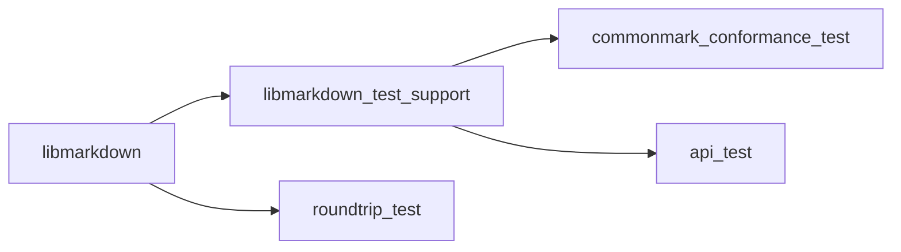
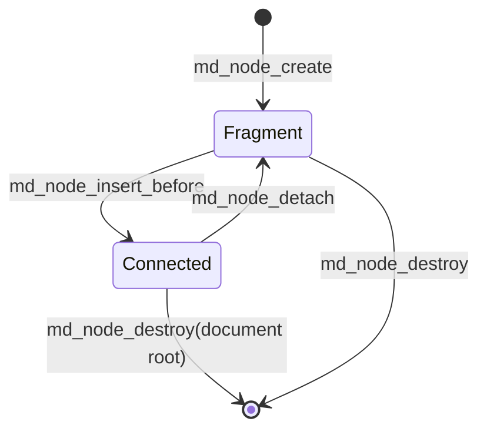
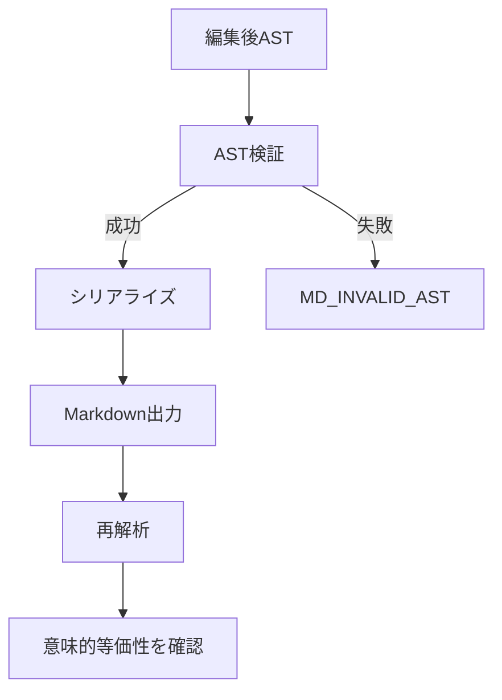

# libmarkdown 設計書

## 1. 目的と適用範囲

本書は、libmarkdown の実装に必要な設計を定義する。libmarkdown は、UTF-8 の Markdown 文字列と編集可能な AST を相互変換する C99 ライブラリである。

公開 API の型、関数、列挙値、マクロおよび操作契約は [公開 C API 設計書](api.md) で定義する。

Markdown の準拠対象は CommonMark Spec 0.31.2 とする。

ライブラリは Markdown の解析、公開 AST の生成・編集・走査・破棄、および AST の Markdown へのシリアライズを提供する。HTML の生成は公開 API および出荷ライブラリの対象外とし、CommonMark 適合性テスト専用の非公開コードに限定する。

ファイル入出力、コマンドラインインターフェース、独自 Markdown 拡張、および入力記法の字句的な再現は対象外とする。

## 2. アーキテクチャ

ライブラリは次の論理コンポーネントで構成する。

1. 入力検証: API 引数を検証する。文字列の UTF-8 妥当性は呼び出し側の前提条件とし、検証しない。
2. ブロック解析: CommonMark のブロック構造を認識する。
3. インライン解析: ブロック内のインライン構造を認識する。
4. AST 構築・編集: ノード、属性、親子関係および所有権を管理する。
5. AST 検証: ノード種別、必須属性、親子関係および木構造の不変条件を検査する。UTF-8 の妥当性は検査しない。
6. Markdown シリアライズ: 有効な AST から意味的に等価な UTF-8 Markdown を構築する。

解析は入力検証、ブロック解析、インライン解析、AST 構築の順に処理する。シリアライズは AST 検証が成功した場合にだけ一時バッファを構築し、生成に成功した場合だけ document が所有する出力バッファと交換する。いずれの処理も失敗時に部分的な結果を成功結果として返さない。

処理の流れを次に示す。

### 2.1 ビルドおよびテスト構成

プロジェクトは CMake で構成し、C99 を使用する。

出荷ライブラリにはテスト専用コードを含めない。

テスト構成は CTest を有効化し、次のターゲットを分離する。

| ターゲット | 内容 | 依存先 |
| --- | --- | --- |
| `libmarkdown` | 出荷ライブラリ | なし |
| `libmarkdown_test_support` | テスト専用 HTML アダプタ、無効 AST フック、生成済み CommonMark フィクスチャ | `libmarkdown` と内部ヘッダ |
| `commonmark_conformance_test` | 公式 example の HTML 比較 | `libmarkdown_test_support` |
| `roundtrip_test` | AST 正規形によるラウンドトリップ比較 | `libmarkdown` |
| `api_test` | AST 編集、所有権、アロケータ、エラー診断 | `libmarkdown_test_support` |

テストターゲットの依存関係を次に示す。

`libmarkdown_test_support` とテスト実行ファイルには `LIBMARKDOWN_TESTING` を定義する。CMake は各テスト実行ファイルを `add_test()` で登録する。ローカルおよび CI の検証手順は、同じ configure、build、`ctest --output-on-failure` の順とする。

## 3. AST の基本契約

AST のルートは `document` ノードとする。各ノードは高々一つの親を持ち、親子関係は循環およびノード共有を含まない。親が所有する子は、親の破棄時に親とともに破棄する。

親子関係の追加は、子が親を持たず、追加後の親子関係がノード種別ごとの許可規則を満たす場合だけ成功する。切り離しに成功した子の所有権は利用者に移る。失敗する編集操作は、ノード、親子関係および所有権を変更してはならない。

対応しないノード種別、不正な属性、不正な親子関係、循環または共有を含む AST は無効とする。文字列の UTF-8 前提、`md_node_t` の不透明性、属性アクセサおよび出力バッファの利用者向け契約は、公開 API の共通規則および各 API リファレンスに従う。

### 3.1 ノード種別と意味属性

AST は次の固定ノード種別を使用する。公開 API における列挙値と未知の値の拒否は、公開 API の契約に従う。

| 区分 | ノード種別 | 意味属性 |
| --- | --- | --- |
| ルート | `document` | なし |
| ブロック | `block_quote` | なし |
| ブロック | `list` | 種別、開始番号、区切り文字、tight/loose |
| ブロック | `list_item` | なし |
| ブロック | `code_block` | コード内容、info string |
| ブロック | `html_block` | HTML 内容 |
| ブロック | `paragraph` | なし |
| ブロック | `heading` | レベル |
| ブロック | `thematic_break` | なし |
| ブロック | `reference_definition` | ラベル、リンク先、タイトル |
| インライン | `text` | テキスト内容 |
| インライン | `soft_break` | なし |
| インライン | `hard_break` | なし |
| インライン | `code` | コード内容 |
| インライン | `html_inline` | HTML 内容 |
| インライン | `emphasis` | なし |
| インライン | `strong` | なし |
| インライン | `link` | リンク先、タイトル |
| インライン | `image` | リンク先、タイトル、alt の inline 子ノード |

`list` の種別は bullet または ordered とする。bullet リストの開始番号および区切り文字は持たず、`delimiter` は `MD_LIST_DELIMITER_NONE` とする。ordered リストの開始番号は 1 以上、区切り文字は period または paren とする。bullet リストに `MD_LIST_DELIMITER_NONE` 以外の delimiter を設定する操作は `MD_INVALID_AST` で失敗する。

`heading` のレベルは 1 から 6 とする。タイトルを持たない `link`、`image` および `reference_definition` は、タイトルを未設定として表現する。`image` の alt は inline 子ノード列で表現し、空 alt は子ノード 0 個で表現する。alt の子には `link` と `image` を置かない。

`list` の tight/loose は明示的な意味属性とする。パーサーは CommonMark の規則に従って値を設定し、利用者は `md_list_set_tight()` で値を変更できる。

複数のブロック子を持つ `list_item` を含む list を tight に設定する操作は `MD_INVALID_AST` で失敗する。`md_node_insert_before()` による子の追加が loose を必然とする場合、ライブラリは追加と同じ原子的な操作で list を loose に更新する。追加または list の更新に失敗した場合は、子の接続、所有権および list の tight/loose を変更しない。子の削除では自動的に tight へ戻さない。

### 3.2 親子関係マトリクス

次表の子だけを追加できる。ブロック集合は `block_quote`、`list`、`list_item`、`code_block`、`html_block`、`paragraph`、`heading`、`thematic_break` および `reference_definition` とする。

インライン集合は `text`、`soft_break`、`hard_break`、`code`、`html_inline`、`emphasis`、`strong`、`link` および `image` とする。

| 親ノード | 許可する直接の子 | document 接続時の最小子数 |
| --- | --- | --- |
| `document` | `list_item` 以外のブロック集合 | 0 |
| `block_quote` | `list_item` 以外のブロック集合 | 1 |
| `list` | `list_item` | 1 |
| `list_item` | `list_item` 以外のブロック集合 | 1 |
| `paragraph`、`heading`、`emphasis`、`strong` | インライン集合 | paragraph/emphasis/strong は 1、heading は 0 |
| `link` | `link` 以外のインライン集合 | 0 |
| `image` | `link`、`image` 以外の inline 集合 | 0 |
| `code_block`、`html_block`、`thematic_break`、`reference_definition`、`text`、`soft_break`、`hard_break`、`code`、`html_inline` | なし | 0 |

`document`、`block_quote` および `list_item` の子に `reference_definition` を置ける。

`reference_definition` は属性だけを持つ葉ノードである。`link` の子孫に `link` を置くことはできない。`link` の子には `image` を置ける。`image` の子は alt を表す inline ノードに限り、`link` と `image` は置けない。image の子ノードは image の所有下に入り、通常の単一親、循環なし、共有なしおよび失敗時非変更の規則に従う。

document は、NULL 終端された最新の Markdown 出力バッファと、その容量および未生成状態を内部に保持する。出力バッファは AST の意味属性ではなく document の派生状態である。出力バッファの所有権および寿命は、公開 API の契約に従う。

### 3.3 構築、編集および構造的不変条件

`md_node_create(MD_NODE_DOCUMENT, ...)` が生成する空の document root は有効な AST とする。document root は `md_node_t` の一種だが、親を持たず、子として追加できず、切り離せない。document root と接続済み木は `md_node_destroy()` で破棄する。

`md_node_create(type, ...)` が生成する親を持たない通常ノードは、document に未接続の構築用フラグメントであり、最小子数を満たさなくてもよい。フラグメントの document 所属は持たず、フラグメントへ子を追加する操作は、3.2 節の親子関係だけを検査する。

フラグメントまたは接続済み部分木を document へ追加する操作は、追加後の全体が 3.2 節の最小子数、必須属性、単一親、循環なし、共有なしおよび link の祖先制約を満たす場合だけ成功する。失敗時は親子関係と所有権を変更しない。

接続済みの `list`、`list_item`、`block_quote`、`paragraph`、`emphasis` または `strong` から最後の子を切り離す操作は `MD_INVALID_AST` で失敗し、子は親の所有のままとする。これらのコンテナ全体を親から切り離す操作は許可する。

未接続のフラグメントは、親が document root であるかどうかにかかわらず、許可された親子関係を満たす親へ接続できる。`md_node_insert_before()` が成功した時点で、child とその子孫は親の所有下に入る。親が document に接続済みの場合は child もその document に接続された部分木となり、親が未接続の場合は child も未接続部分木にとどまる。接続に失敗した場合は、child の未接続状態、親子関係および所有権を変更しない。

document の破棄は接続済みの根の子孫を破棄するが、既に切り離されたフラグメントは破棄しない。切り離されたフラグメントは `md_node_destroy()` で利用者が破棄する。

各フラグメントは破棄時点のグローバルアロケータを参照する。元の document が破棄された後も、利用者が設定変更前に確保されたメモリを新しいコールバックで扱えること、および設定変更とフラグメント操作の同期を保証する限り破棄できる。

ノードの所有権状態を次に示す。

### 3.4 参照定義

パーサーは全 document を対象として参照定義を収集する。ラベル比較には CommonMark の大文字小文字折り畳みと Unicode 空白の正規化を用い、同じ正規化ラベルが複数ある場合は文書順で最初の定義を解決に使用する。すべての定義ノードは AST に保持する。

参照リンクと短縮参照リンクは、解析時に解決済みの `link` または `image` ノードへ変換する。変換後のノードはリンク先とタイトルを持ち、入力の参照ラベルや記法を保持しない。未解決の参照は CommonMark の規則に従って通常テキストとして扱う。解析後に reference_definition を追加、削除、移動または変更しても、既存の `link` と `image` は再解決しない。

### 3.5 AST 正規形

AST 正規形は、各ノードを深さ優先・子の順序どおりに表現するテスト専用のバイト列とする。表現は `kind{field=length:bytes,...}[children]` とし、field は表の順序で出力する。`length` は bytes のバイト数、children は子ノードの正規形を順序どおりに連結したものとする。未設定のタイトルは `title=null`、子のないノードは `[]` と表す。

| ノード種別 | 正規形に含める field |
| --- | --- |
| `document`、`block_quote`、`list_item`、`paragraph`、`thematic_break`、`soft_break`、`hard_break`、`emphasis`、`strong` | なし |
| `list` | kind、start、delimiter、tight |
| `code_block` | literal、info |
| `html_block`、`html_inline` | literal |
| `heading` | level |
| `reference_definition` | label、destination、title |
| `text` | literal |
| `code` | literal |
| `link` | destination、title |
| `image` | destination、title。children は alt の正規形を順序どおりに表す |

正規形はソース位置、入力時の記法選択、改行形式、フェンス記号、見出し記法、リストの bullet 記号、および記法上のみ必要な空白を含めない。コード内容、テキスト内容、インデント、ハード改行およびすべての意味属性は含める。

## 4. メモリ管理

グローバルアロケータ契約と公開操作の所有権・寿命・失敗時契約は、公開 API の契約に従う。

## 5. シリアライズ契約

シリアライザは有効な AST だけを入力として受け付ける。無効な AST では、診断可能な失敗を返し、AST を変更せず、部分的な出力を成功結果として返してはならない。

`md_serialize()` は document 内部の出力バッファとは別の一時バッファへ Markdown 全体を構築する。AST 検証、シリアライズおよび終端処理が成功した場合だけ、一時バッファを document の出力バッファと交換し、`str` にその NULL 終端文字列への読み取り専用ポインタを設定する。確保または再確保に失敗した場合は document の AST と出力バッファを部分的な結果へ変更せず、失敗を返す。

シリアライズ結果の所有権および寿命は、公開 API の契約に従う。

成功したシリアライズ結果を再解析した AST は、ノード種別、子ノード順序、意味属性およびテキスト内容について入力 AST と意味的に等価とする。ソース位置、入力時の記法選択、改行形式、および記法上のみ必要な空白は保持対象としない。

AST 検証とラウンドトリップの関係を次に示す。

### 5.1 正規化記法

シリアライザは常に LF を使用し、ブロック間を空行一つで区切る。

見出しは ATX 形式、bullet list は `-`、ordered list は最初の項目を list の開始番号、後続項目を連番の `.` 区切りで出力する。tight list では list item 間および item 内のブロック間に空行を出力せず、loose list では各 list item のブロック境界を空行で区切る。block quote の各出力行には `> ` を付け、list item の継続行は marker と空白の幅だけインデントする。

リンクと画像は常にインライン形式で出力する。`link` は子の inline 正規形を角括弧で囲み、`image` は `!`、alt 子ノードの正規形、destination および任意の title を用いて出力する。空 alt は `` とする。alt の出力は image label 文脈として扱い、閉じ角括弧、開き角括弧、emphasis、code、HTML およびバックスラッシュの開始に使われる文字を、再解析時に子ノード境界が変わらないようエスケープする。`reference_definition` は AST 上の位置で、正規化済みラベル、リンク先およびタイトルから参照定義として出力する。参照定義の順序は AST の子順序に従い、参照定義の追加、削除、移動または属性変更は既存の `link` と `image` の解決済み属性を変更しない。

HTML ノードは literal を変更せず出力する。ハード改行はバックスラッシュと LF、ソフト改行は LF とする。

コードブロックは、backtick を fence に選ぶ場合は内容に含まれる最長 backtick run より一つ長く、少なくとも 3 文字の fence を用いる。info string が backtick を含む場合は tilde を選び、内容に含まれる最長 tilde run より一つ長く、少なくとも 3 文字の fence を用いる。info string の改行は許可せず、fence 文字列と info string の間には一つの空白を置く。

テキストと属性は、出力文脈で再解析時にノード境界、ブロック開始またはリンク構文を変える ASCII 記号だけをバックスラッシュでエスケープする。block 文脈では行頭の構文開始文字、inline 文脈では emphasis、link、image、hard break および HTML の開始に使われる文字、link destination 文脈では `)` と `\\`、title 文脈では区切り文字と `\\` を対象とする。バックスラッシュ自身は必要な文脈で二重化し、改行は各ノードの改行規則で出力する。code fence 文脈では選択した fence 文字の run と info string の backtick を衝突しない形で処理する。エスケープ規則は次表の優先順位で適用する。

| 文脈 | エスケープの目的 | 必須条件 |
| --- | --- | --- |
| block | 行頭での block 開始を防ぐ | 構文開始文字の前に `\\` を置く。行頭の空白と改行は block 出力規則を優先する |
| inline | ノード境界と inline 構文を保持する | `\\`、`*`、`_`、`[`、`]`、`<` および必要な `!` を構文として解釈されない形にする |
| link destination | destination の終端を保持する | `\\` と `)` をエスケープし、空白を含む destination は angle-bracket 形式を使用する |
| title | title の区切りを保持する | 選択した引用符と `\\` をエスケープし、改行は LF に正規化する |
| code fence | code literal の終端を防ぐ | 選択した fence 文字の最長 run より長い fence を選び、info string の backtick は tilde fence を選ぶ |

エスケープ後の各出力は再解析して、元のノード種別、境界および属性が得られることをラウンドトリップテストで確認する。

## 6. 検証方針

CommonMark 適合性テストは、CommonMark Spec 0.31.2 の公式 example を出現順に抽出した、リポジトリ管理下のテストフィクスチャを入力として実行する。各フィクスチャは example 番号、Markdown および期待 HTML を含む。

生成時は単独の `.` 行で入力と期待値を区切り、`→` はタブへ戻す。各 example は Markdown を解析し、テスト専用 HTML アダプタで変換した結果を期待 HTML と比較する。比較時は改行コードだけを LF に正規化する。

### 6.1 CommonMark フィクスチャ形式

`tools/extract_commonmark_examples.js` は CommonMark Spec 0.31.2 の仕様書を入力として、`tests/fixtures/commonmark_0_31_2_examples.c` と対応するヘッダを生成する。

生成データの各要素は example 番号、Markdown バイト列と長さ、期待 HTML バイト列と長さを持つ。バイト列の長さを明示するため、末尾改行を含む期待 HTML を正確に比較できる。

生成ツールはフィクスチャの更新時にだけ使用する開発用ツールである。CMake の configure、build および test は、コミット済みの生成データを使用する。

CMake の configure、build および test は、Node.js、ネットワークまたは仕様書の取得を要求してはならない。フィクスチャはテスト専用ターゲットだけにリンクし、出荷ライブラリには含めない。

### 6.2 無効 AST のテストフィクスチャ

`tests/support/invalid_ast_builder.h` と `tests/support/invalid_ast_builder.c` は、テスト専用の無効 AST フィクスチャを作る。これらは内部ヘッダだけを利用し、通常の公開 API には含めない。

`src/internal/ast_test_hooks.c` は `LIBMARKDOWN_TESTING` が定義されたテスト用ターゲットだけにリンクする。循環、共有ノード、不正親子関係、必須属性欠落および不正な list 属性を構築できる。

出荷ライブラリのターゲットは `ast_test_hooks.c` と `tests/support` を含めてはならない。各無効 AST フィクスチャは `md_serialize()` が `MD_INVALID_AST` を返し、`str` を成功結果へ変更せず、入力 AST と document の出力バッファを部分的な結果へ変更しないことを検証する。

ラウンドトリップテストは、Markdown を解析し、シリアライズ後に再解析して AST 正規形を比較する。AST 正規形にはノード種別、子ノード順序、意味属性およびテキスト内容を含める。ソース位置、入力時の記法および正規化された改行形式は含めない。

API 品質テストは、AST の生成・編集・削除・走査、無効な編集の原子性、list delimiter の kind 別制約、tight list への子追加による loose 自動更新、image の alt 子ノード編集と不正な link/image 子の拒否、解析後の reference_definition 編集が既存 link/image を再解決しないこと、既定およびカスタムアロケータ、不正引数、空文書、改行形式、深いネスト、document 所有出力の寿命、再シリアライズ時の旧ポインタ無効化および複数出力の同時保持不可を対象とする。

シリアライザの境界テストは、bullet list の delimiter 不正値、tight/loose list の空行、内容中の backtick/tilde run、info string の backtick、文脈別の括弧・引用符・バックスラッシュ・構文開始文字、空 destination、改行を含む title、空 alt、inline 構造を含む alt、alt 内の括弧・角括弧・バックスラッシュ、および inline link/image の再解析結果を対象とする。

さらに、アロケータAからBへの設定変更後に行う既存 document、ノード、切り離しフラグメントおよび document 所有出力の操作・破棄、不正な設定の拒否、設定失敗時の現在設定の保持、ならびに再確保失敗時の原子性を検証する。document 破棄後に出力ポインタを参照しないこと、失敗後に再シリアライズできることも検証する。

## 7. 要件トレーサビリティ

| 要件 | 設計上の対応 |
| --- | --- |
| FR-1 | 第2節の入力検証・解析構成、および第6節の CommonMark 適合性検証。 |
| FR-2 | 第3節の AST 所有権、不変条件、編集の原子性、および公開 API の編集操作契約。 |
| FR-3 | 第5節のシリアライズ契約、第6節のラウンドトリップ検証、および公開 API の出力契約。 |
| FR-4 | 公開 API のグローバルアロケータ契約。 |
| FR-5 | 対応しないノード種別の拒否、およびコンポーネント分割。 |
| NFR-1 | 第2.1節の C99 強制、出荷ターゲットおよび CTest 構成。 |
| NFR-2 | 第2節および第3節の UTF-8 に関する呼び出し側前提条件。 |
| NFR-3 | 第2節、第5節、公開 API の共通規則および各 API リファレンスの失敗時契約。 |
| VR-1 | 第6節の公式 CommonMark 適合性テスト。 |
| VR-2 | 第5節および第6節の意味的等価性と AST 正規形。 |
| VR-3 | 第3節、公開 API の共通規則、各 API リファレンスおよび第6節の API 品質テスト。 |
| VR-4 | 第2.1節の CMake configure、build、CTest 構成。CI サービスとコンパイラの最低版は後続設計で定める。 |

## 8. 後続の決定事項

CI サービス、コンパイラの最低対応版、性能目標、最大入力サイズ、最大ネスト深さ、および独自 Markdown 拡張は、実装の検証後に後続設計として定める。
